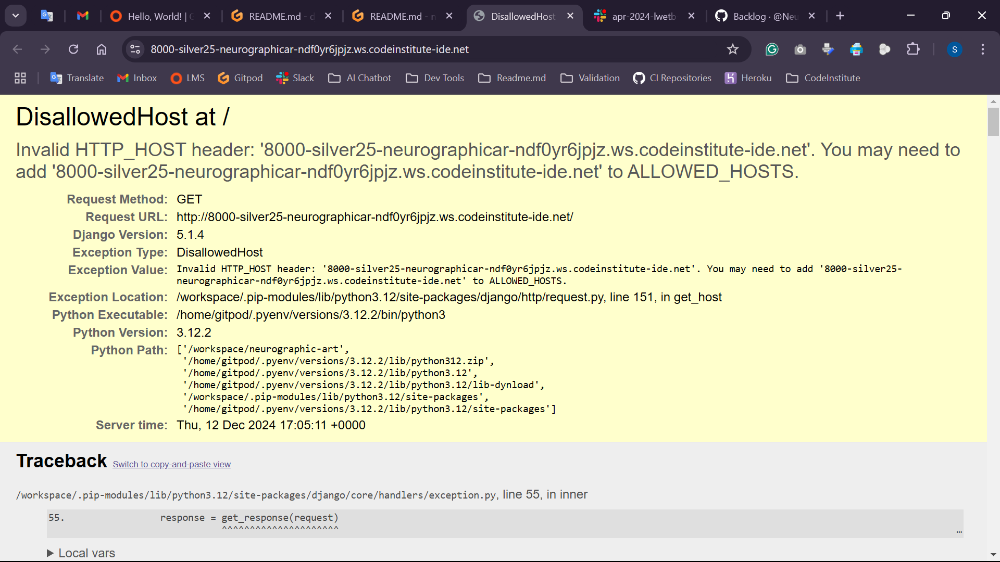
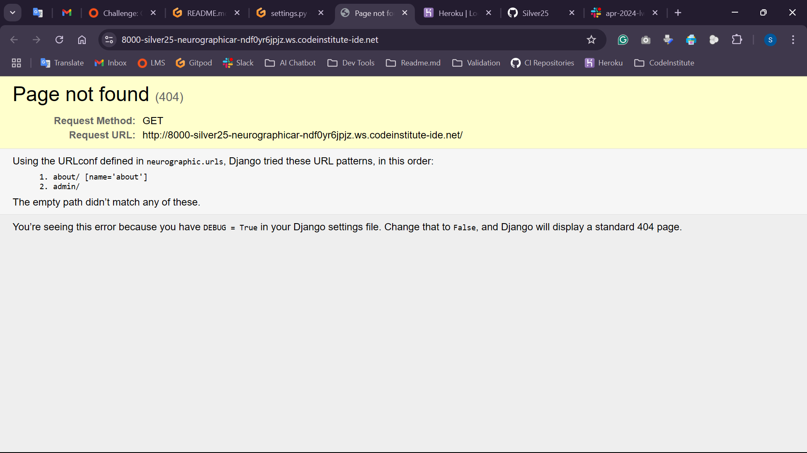
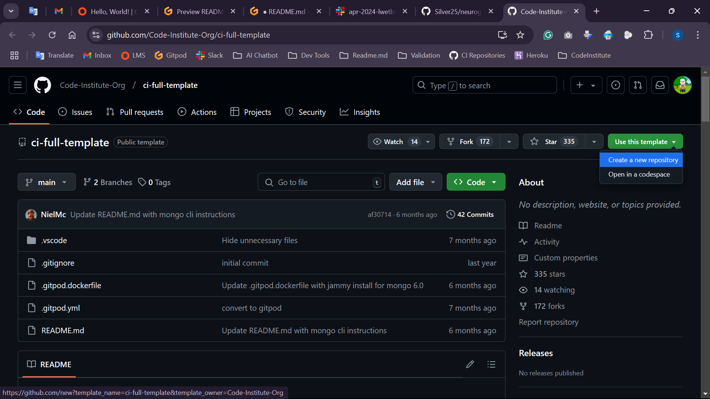
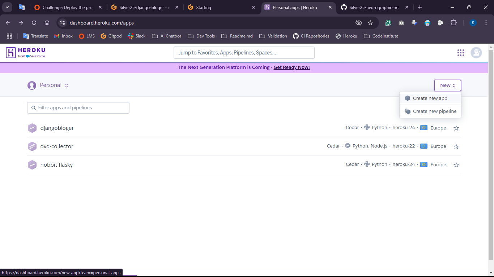
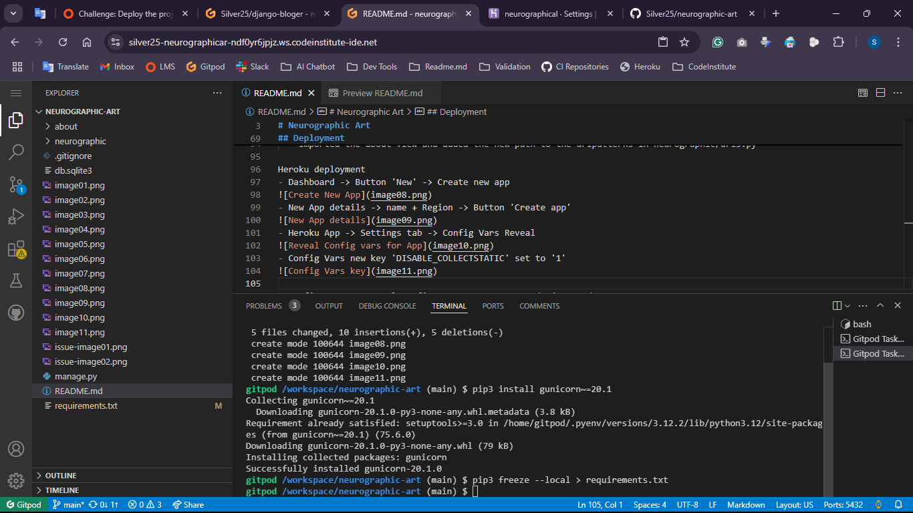
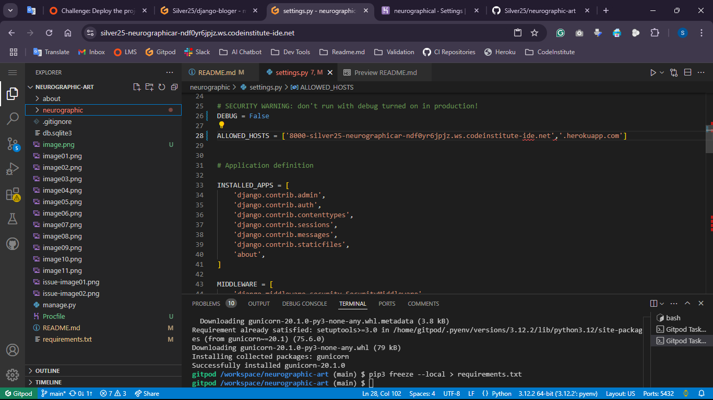

# Neurographic Art

## Purpose

## Description [Interactive Responsive Website]

## UX Design
Proposed by Jesse James Garrett, this process is represented as five levels of activity called planes.  
These planes and their concerns are as follows.

### Target audience

### First Time Visitor Goals

### Returning Visitor Goals

### User Stories
- Kanban board created as a GitHub Issues: https://github.com/users/Silver25/projects/3
- MoSCow prioritization [for PBIs - Product Backlog Items]:
- Must Have / Should Have / Could Have / Won’t Have (GitHub Issues)
- create user story template file [user-story.md]
- git pull to update preview on Gitpod VS GUI
- write these lines as reminder

### The strategy plane: 
What are you aiming to achieve in the first place and for whom?

### The scope plane: 
Which features, based on information from the strategy plane, do you want to include in your design?
What's on the table for a production release and what's not, at least for now?

### The structure plane: 
How is the information structured and how is it logically grouped?

### The skeleton plane: 
How will our information be represented, and how will the user navigate to the information and the features?

### The surface plane: 
What will the finished product look like?
What colors, typography, and design elements will we use?

### Wireframes

### Colour Scheme

### Typography

## Features

### Future Features

## Testing

### Manual Testing

### Validator Testing

### Bugs and Issues

- Running the Project for the first time in the browser and Django doesn't recognise the hostname

[ Resolved with adding the hostname to ALLOWED_HOSTS, inside project/settings.py file ]

- Django App first run in the browser issue [ resolved with manually adding /about on the end ]

## Deployment

Local deployment on workstation
- from installation of Python on Windows OS to runing project in the browser

Setup and startup of the Project in Cloud
- Create new GitHub repository from template

- Apply settings for new repo

- Start Gitpod Dashboard to create new Workspace

- Chosen project starting preparation

- Building Workspace with all necessary elements

- Installed Django using the following command in the Terminal: pip3 install Django~=5.1.4
- Added the package to the requirements.txt file with the command: pip3 freeze local > requirements.txt
- Creating the Django Project in Terminal:
  - Created the new project, "Neurographic", using the Django built-in function: django-admin startproject neurographic .
- Creating the new app in Terminal:
  - Created the new app: about, using the Django built-in function: python3 manage.py startapp about

  - Added the app to the list of installed apps in neurographic/settings.py
  - Imported HttpResponse from django.http and view function in about/views.py
  - Imported the about view and added the new path to the urlpatterns in neurographic/urls.py

Heroku deployment
- Dashboard -> Button 'New' -> Create new app

- New App details -> name + Region -> Button 'Create app'

- Heroku App -> Settings tab -> Config Vars Reveal

- Config Vars new key 'DISABLE_COLLECTSTATIC' set to '1'

- Gitpod IDE Terminal -> Gunicorn server preparation setup

- Terminal -> Procfile created -> Heroku as ALLOWED_HOSTS

- Buildpacks -> Add buildpack -> Python + Node.js
- Deploy tab -> Deployment method -> GitHub -> Connect to GitHub -> Authorize Heroku
  -> Popup window -> Sign in to GitHub -> Search for gitHub project
- Manual deploy -> Deploy a GitHub branch -> Deploy Branch button
- Receive code from GitHub -> Build main ...
- Your app was successfully deployed. -> View button

## Technologies

## Credits [Acknowledgments]

Me, Myself and I
---
---

## Gitpod Reminders

For a frontend (HTML, CSS, JS only) apps in Gitpod, Terminal: **python3 -m http.server**

For a backend Python file, Terminal: **python3 run.py**  [ if name of the file is 'run.py' ]

To run the Django server in the Terminal: **python3 manage.py runserver**

To log into the Heroku toolbelt CLI:

1. Log in to your Heroku account and go to *Account Settings* in the menu under your avatar.
2. Scroll down to the *API Key* and click *Reveal*
3. Copy the key
4. In Gitpod, from the terminal, run `heroku_config`
5. Paste in your API key when asked

You can now use the `heroku` CLI program - try running `heroku apps` to confirm it works. This API key is unique and private to you, so do not share it. If you accidentally make it public, you can create a new one with _Regenerate API Key_.

### Connecting your Mongo database

- **Connect to Mongo CLI on a IDE**
- navigate to your MongoDB Clusters Sandbox
- click **"Connect"** button
- select **"Connect with the MongoDB shell"**
- select **"I have the mongo shell installed"**
- choose **mongosh (2.0 or later)** for : **"Select your mongo shell version"**
- choose option: **"Run your connection string in your command line"**
- in the terminal, paste the copied code `mongo "mongodb+srv://<CLUSTER-NAME>.mongodb.net/<DBname>" --apiVersion 1 --username <USERNAME>`
  - replace all `<angle-bracket>` keys with your own data
- enter password _(will not echo **\*\*\*\*** on screen)_

Responsive visual <b style="color: yellow;">(open here)</b>

<!-- Change code from  -->

