# Neurographic Art

## Purpose

## Description [Interactive Responsive Website]

Discover the World of Neurographic Art: Transform Your Mind, Emotions, and Creativity  

Welcome to your ultimate resource for understanding and exploring Neurographic Art.  
A transformative and meditative art form that melds psychology, neuroscience, and creativity.  
On this site, you'll delve into the fascinating world of this unique technique, where simple lines and shapes evolve into intricate, meaningful compositions.  

Live site reachable at https://neurographical-915fed1a7d6c.herokuapp.com/

## UX Design
Proposed by Jesse James Garrett, this process is represented as five levels of activity called planes.  
These planes and their concerns are as follows.

### Target audience

### First Time Visitor Goals

### Returning Visitor Goals

### User Stories
- Kanban board created as a GitHub Issues: https://github.com/users/Silver25/projects/3  
  
  
  
  
  
  
  
  
  

### The strategy plane: 
What are you aiming to achieve in the first place and for whom?

### The scope plane: 
Which features, based on information from the strategy plane, do you want to include in your design?
What's on the table for a production release and what's not, at least for now?

### The structure plane: 
How is the information structured and how is it logically grouped?

### The skeleton plane: 
How will our information be represented, and how will the user navigate to the information and the features?

### The surface plane: 
What will the finished product look like?
What colors, typography, and design elements will we use?

### Wireframes

### Colour Scheme

### Typography

## Features

- Top/main Menu

- Footer

- Journal page - post listing

- Journal page - post listing with post images

- Navigation through all published posts

- Comment form -  allow registered users to create a new comment

- Published comments preview with total number of comments for the related post

- Comment Edit button - for the registered users with the option to edit a existed comment
- Comment Update button - for the registered users with the option to update a existed comment
- About page
- Successful login, logout, submit, update message for the user on the top

- Login form

- Logout choice
- Sign out page with second level action to confirm choice

- Signup form
- Contact form
- Social Media links
- Newsletter subscribtion form

### Future Features

- On mobile devices, the featured image is displayed below the title
- Registered User can update post with assigned Role
- Unsubscribe from newsletter list link/button

## Testing

### Manual Testing

- Test of the Main top page menu = PASS
- Test of the displayed published posts = PASS
- Test of the navigation for posts = PASS
- Test for the opening of the choosen post = PASS
- Test for the Admin area = PASS
- Test for the CRUD action for the Post in the Admin area = PASS
- Test for the CRUD action for the User in the Admin area = PASS
- Test for the CRUD action for the Comment in the Admin area = PASS
- TEST for the Registration form for the new User
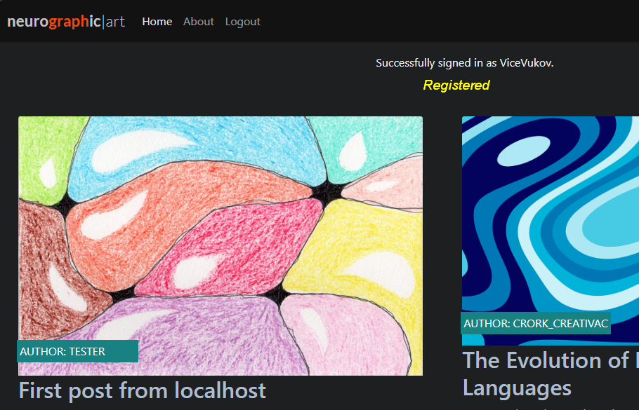
- Test for the login and logout of the user = PASS
- Test for the message display related to action from the User = PASS
- Test for a login with wrong credentials = PASS
- Test for the access to Admin area as a logged-in User = PASS
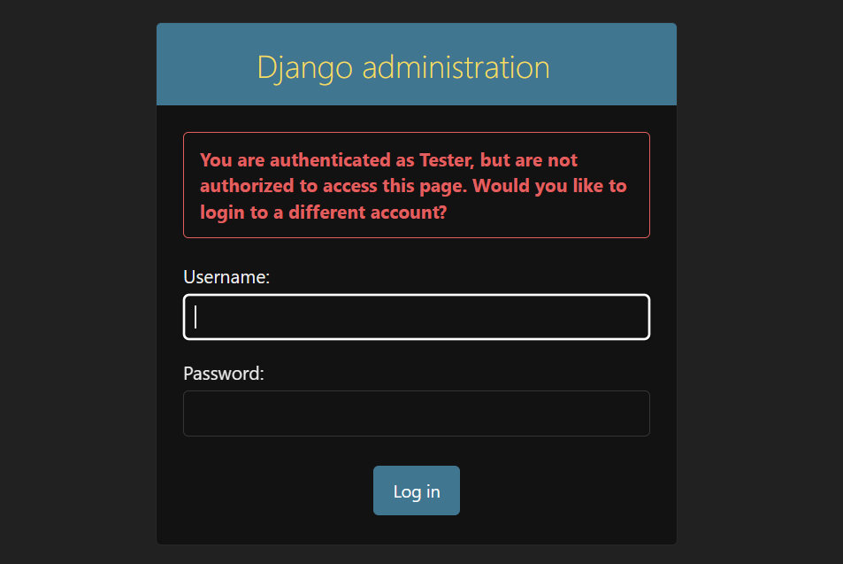
- Test for the CRUD action for the Comment content by the User = PASS
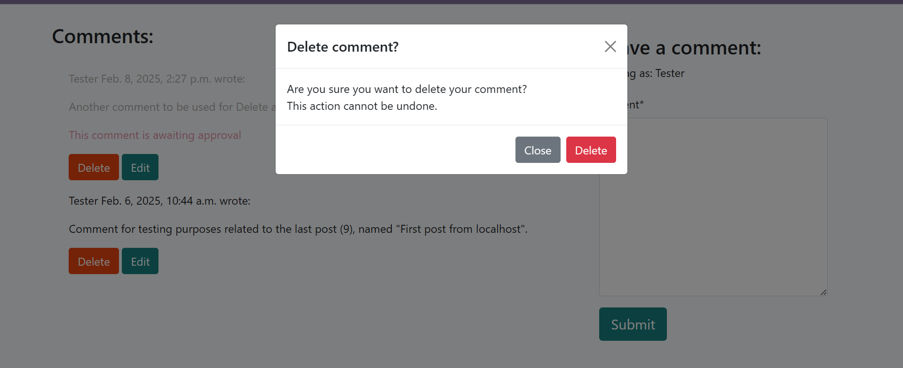
- Test for display of the default post image over the post in post listing = PASS
- Test for upload of the Post custom-featured image from the Admin panel = PASS
- Test for edit/delete option in Admin/Newsletter area = PASS
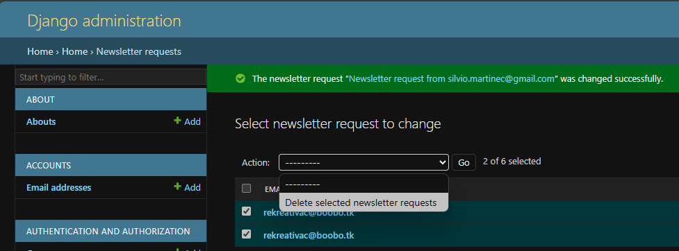
- Test of the confirmation on the action = PASS
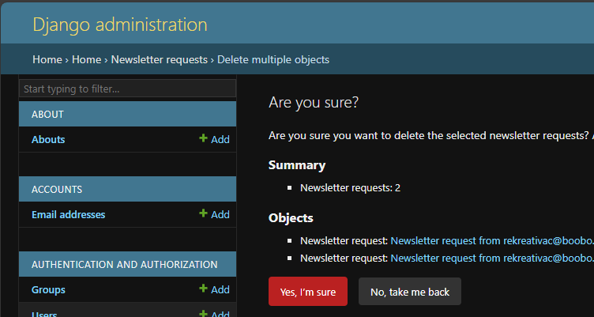

### Validator Testing

- HTML: **https://validator.w3.org/**
- about.html as a link to page
- post page for authenticated user with View Source -> Copy -> Paste code to Validate by direct input
- Error for comment-id -> post_detail.html -> data-comment_id -> comments.js -> data-comment_id
- CSS: **https://jigsaw.w3.org/css-validator**
- Lighthouse: **https://pagespeed.web.dev/**
- JavaScript: **https://www.jshint.com/**
- Python: **https://pep8ci.herokuapp.com/#**

### Bugs and Issues

- Running the Project for the first time in the browser and Django doesn't recognise the hostname

[ Resolved with adding the hostname to ALLOWED_HOSTS, inside project/settings.py file ]
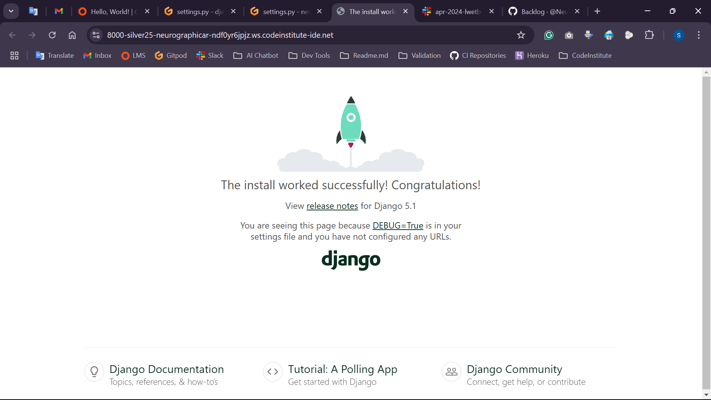
- Django App first run in the browser issue [ resolved with manually adding /about on the end ]

- The issue with the 'Push' command in IDE Terminal after some changes/commits were done directly on GitHub space
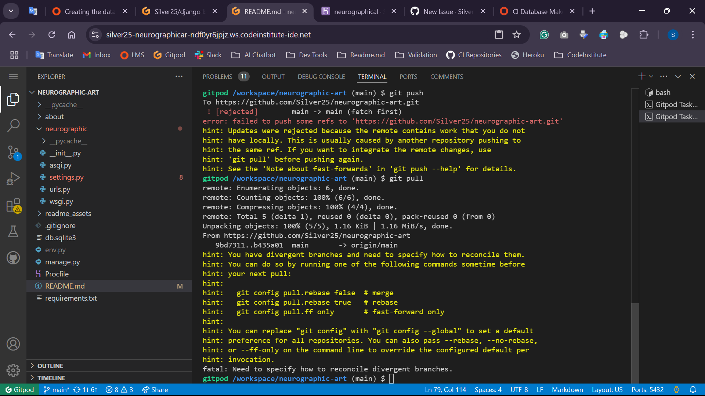
- Resolved
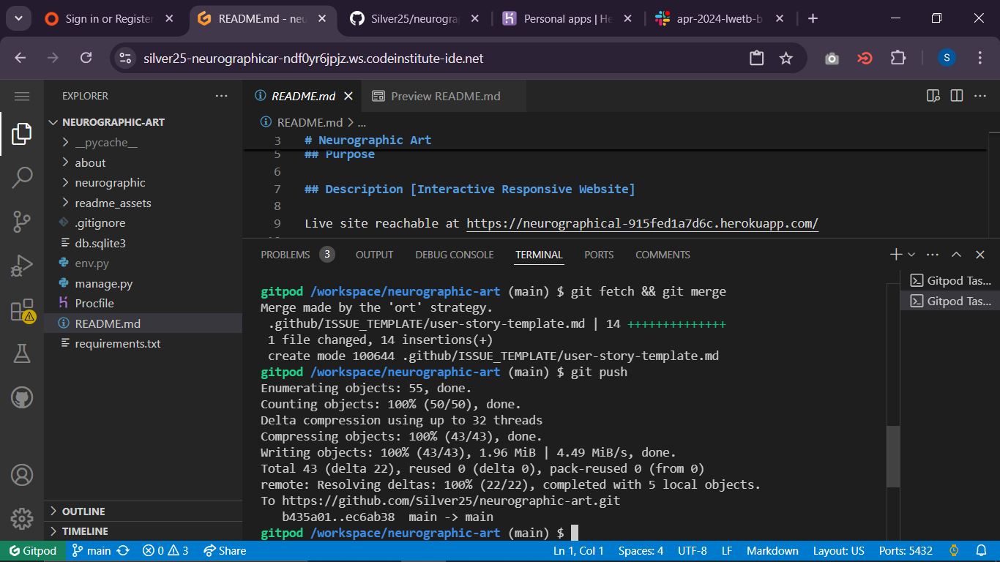
- Error with About app, run server command stop all, on localhost, after migration
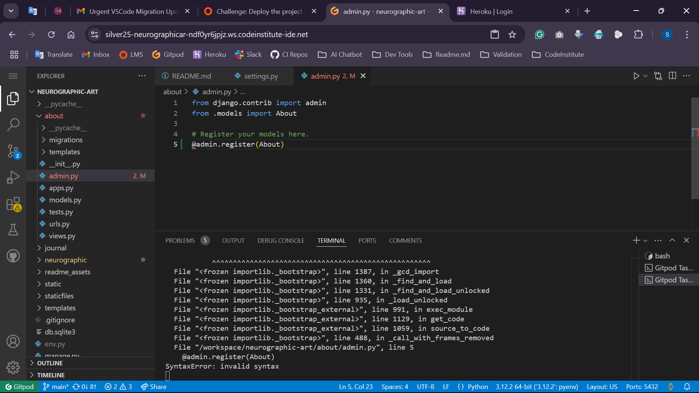
- ModuleNotFoundError: No module named 'crispy_forms' on second computer, resolved with installation
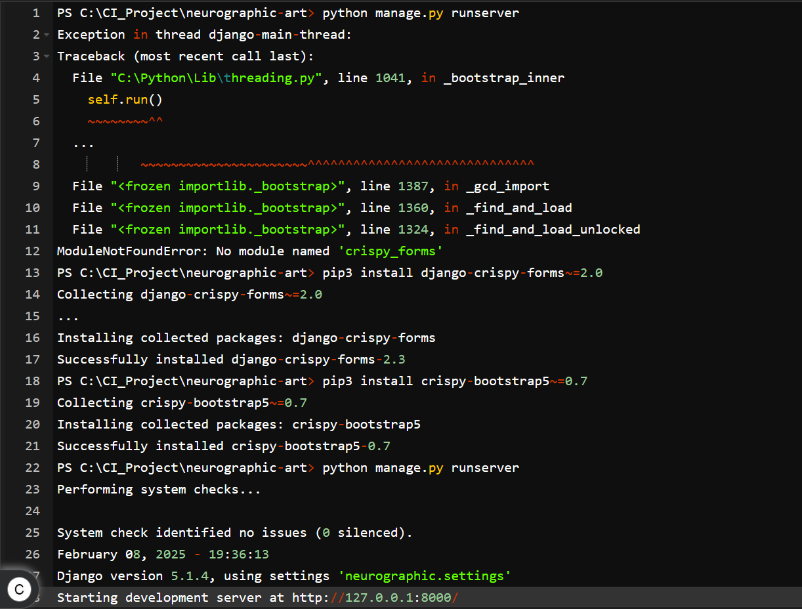
- ImproperlyConfigured: The SECRET_KEY setting raise error and block the local server from running the site
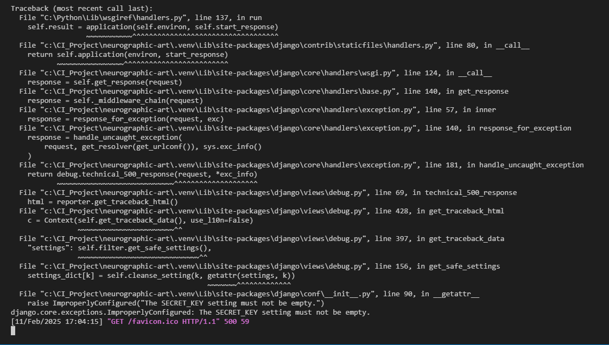
- [ Resolved with creating a new Secret Key from the Terminal and placed it in the env.py file ]
- Issue with import of the comment content for Edit, inside 'textarea' of the form. Didn't fill the form field.
- [ Resolved with the change of the field name configured in models.py ]
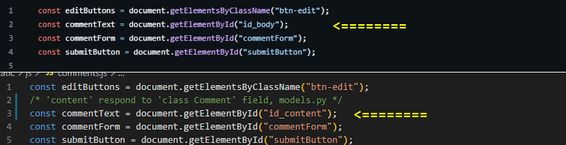

## Deployment

### Local deployment on workstation
- from installation of Python on Windows OS to runing project in the browser

### Setup and startup of the Project in Cloud
- Create new GitHub repository from template

- Apply settings for new repo

- Start Gitpod Dashboard to create new Workspace

- Chosen project starting preparation

- Building Workspace with all necessary elements

- Installed Django using the following command in the Terminal: pip3 install Django~=5.1.4
- Added the package to the requirements.txt file with the command: pip3 freeze local > requirements.txt
- Creating the Django Project in Terminal:
  - Created the new project, "Neurographic", using the Django built-in function: django-admin startproject neurographic .
- Creating the new app in Terminal:
  - Created the new app: about, using the Django built-in function: python3 manage.py startapp about

  - Added the app to the list of installed apps in neurographic/settings.py
  - Imported HttpResponse from django.http and view function in about/views.py
  - Imported the about view and added the new path to the urlpatterns in neurographic/urls.py
  - Created new class 'Post' as a model of the app Journal and register for the Django and database
  
  - Post model displayed in Django administration area
  

### Heroku deployment
- Dashboard -> Button 'New' -> Create new app

- New App details -> name + Region -> Button 'Create app'

- Heroku App -> Settings tab -> Config Vars Reveal

- Config Vars new key 'DISABLE_COLLECTSTATIC' set to '1'

- Gitpod IDE Terminal -> Gunicorn server preparation setup

- Terminal -> Procfile created -> Heroku as ALLOWED_HOSTS

- Heroku connecting to GitHub project

- Heroku App -> Deploy tab -> Deployment method -> GitHub -> Connect to GitHub -> Authorize Heroku
  -> Popup window -> Sign in to GitHub -> Search for gitHub project
- Manual deploy -> Deploy a GitHub branch -> Deploy Branch button

- Receive code from GitHub -> Build main ...
- Your app was successfully deployed. -> View button

- Connection with Database, creating the tables and Admin credentials in IDE

- Connection with the Database on Heroku

- Remove Config Vars key 'DISABLE_COLLECTSTATIC' so Heroku can use static files

## Technologies
- HTML language
- Bootstrap [CSS] framework
- Python language
- Django framework
- Postgres database
- JavaScript

## Tools
- Visual Studio Code code editor [https://code.visualstudio.com/]
- Git version control system [https://git-scm.com/]
- Gitpod online code editor [https://www.gitpod.io/]
- GitHub developer platform [https://github.com/]
- Agile technique - GitHub Issues tables [Kanban board]

## Credits [Acknowledgments]

Images and photographs created by Me, Myself and I
Font style created by Google Fonts [https://fonts.google.com/]
Footer icons provided by Font Awesome [https://fontawesome.com/icons]
FotoJet - creating photo collages [https://www.fotojet.com/]
Photovisi photo collage maker [https://www.photovisi.com/]
Pixlr's online collage maker [https://pixlr.com/photo-collage/]
---
Online simple Kanban style task process board [https://notepad.js.org/kanban/]
Google Translate [https://translate.google.com/]
Control Vi to edit and download image from clipboard [https://ctrl.vi/]
Folge - paste image from clipboard to download [https://folge.me/tools/]
Lorem Ipsum - generator of dummy text [https://www.lipsum.com/]
Quillbot Fix grammar, spelling, and punctuation errors [https://quillbot.com/paraphrasing-tool]
Humanize AI-generated content into natural, human-like text [https://www.humanizeai.pro/]
---
- Complete Basic Django Series [https://djangotherightway.com/]
- Content made for the Django Community [https://django.wtf/]
- Answers and suggestions [https://stackoverflow.com/tags]
- Creating Readme [https://github.com/kera-cudmore/readme-examples]
- Code Institute Solutions [https://github.com/Code-Institute-Solutions/blog/tree/main]
- Git documentation [https://git-scm.com/doc]
- DevTools documentation [https://learn.microsoft.com/en-gb/microsoft-edge/devtools-guide-chromium/landing/]
- Google Dev Sources [https://developers.google.com]
- Art & Object [https://www.artandobject.com/]
- Irish Journal of Psychological Medicine [https://www.cambridge.org/core/journals/irish-journal-of-psychological-medicine]
- American Psychological Association [https://psycnet.apa.org/home]
---
